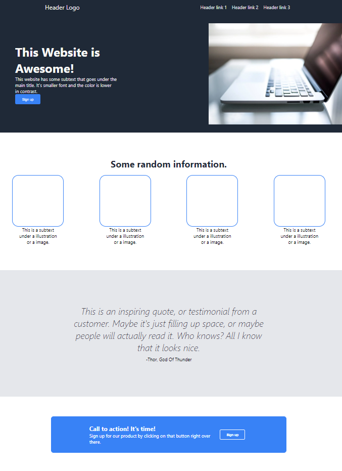

# Landing Page Project

To acces is go to: https://sapandeep31.github.io/odin-landingpage

This project is a simple landing page created using HTML and CSS. The page includes a navigation bar, a main content section with a title and subtext, an image, some additional sections with information, a testimonial, a call to action, and a footer.

## Table of Contents

- [Project Structure](#project-structure)
- [Technologies Used](#technologies-used)
- [Setup](#setup)
- [Features](#features)
- [Screenshots](#screenshots)
- [Acknowledgements](#acknowledgements)

## Project Structure

The project consists of the following files:
├── index.html
└── styles.css

less
Copy code

### `index.html`

The HTML file contains the structure of the landing page, including:
- A navigation bar with a logo and header links
- A main content section with a title, subtext, a sign-up button, and an image
- Additional sections for information, a testimonial, a call to action, and a footer

### `styles.css`

The CSS file provides the styling for the landing page, including:
- Font styles and layout properties
- Colors and background colors
- Padding, margin, and other spacing properties
- Flexbox properties for layout alignment

## Technologies Used

- HTML5
- CSS3

## Setup

To view the project, simply open the `index.html` file in your web browser. No additional setup is required.

## Features

- Responsive navigation bar with header links
- Main content section with a title, subtext, sign-up button, and image
- Additional information sections with styled boxes
- Testimonial section with an inspiring quote
- Call to action section with a sign-up button
- Footer with copyright information

## Screenshots

## Acknowledgements

This project was created by Sapandeep Singh. The image used in the project is sourced from [Pexels](https://www.pexels.com/).